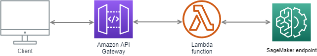

# xm4ecast
Costa Rica's exports forecast

This project was designed to be able to generate a forecast Costa Rica's exports, in order to get this variable by each month and year.
The code is available publicly and a it respective API too. THe production model was executed using Amazon SageMaker and the API with Lambda and API Gateway.
A diagram of the arquitecture is showed:

The model used is a linear learner from SageMaker and some of the feautures are: Costa Rica's imports, Mensual production index (IMAE), Crude oil price, Gas price, 3 Month Treasury Bill Rate, Yuan-dollar exchange rate, year and month. Those variables are donwloaded using public APIs and added to the model. To receive an model prediction you must use those variables in the API call.

To/do list:

- [ ] hyperparameter tuning
- [ ] Xgboost variant
- [ ] PCA for some feautures
- [ ] Telegram bot
